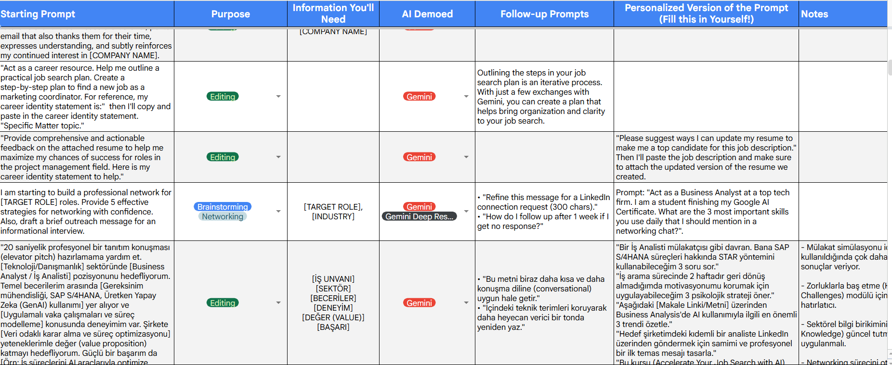
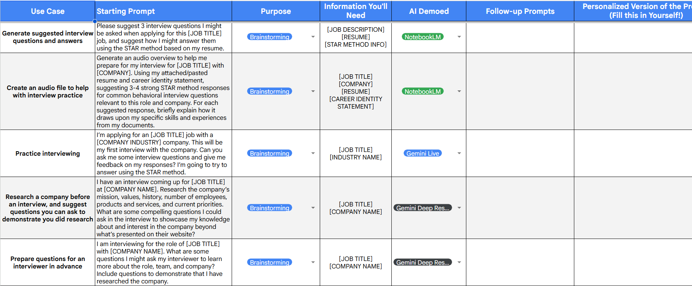
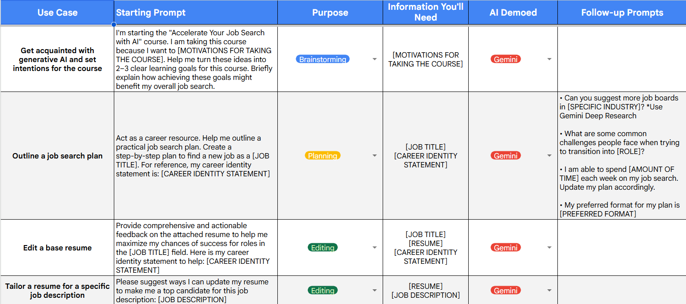
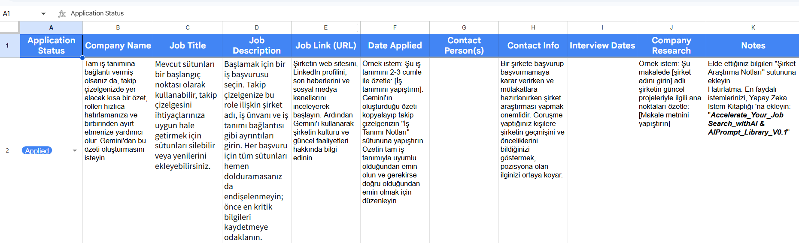
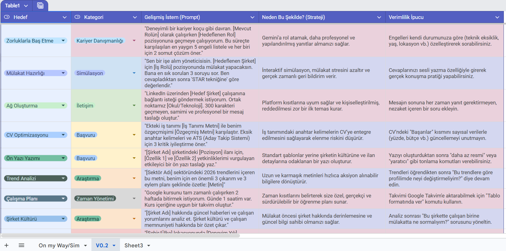

# AI-Powered Job Search & Decision Support Framework

<p align="center">
  
  
  
</p>

<p align="center">
  
  
  
</p>

<p align="center">
  
  
  
</p>

---

## Project & Documentation Overview

Bu depo (*repository*), **Google Career - Accelerate Your Job Search with AI** metodolojisinden elde edilen teorik ve pratik içgörülerin, **Obsidian (.md)** mimarisiyle yapılandırılmış dinamik bir dokümantasyon setini içerir. Amaç, iş arama, başvuru takibi ve mülakat hazırlığını parametrik, tekrar kullanılabilir modüllerle destekleyen bir karar destek çerçevesi sunmaktır.

Sıradan bir ders notu dökümünden farklı olarak bu çalışma; iş analizi, veri bilimi ve yapay zeka entegrasyonu süreçlerinin kariyer navigasyonuna **parametrik** ve **modüler** olarak nasıl entegre edilebileceğini gösterir. Bu README, projenin üst düzey amaç ve akışını özetler; detaylar ve örnekler Obsidian vault içindeki ilgili notlarda bulunabilir.

---

## Table of Contents

- [Architectural Modules: Ne İşe Yarar & Nasıl Kullanılır?](#architectural-modules-ne-işe-yarar--nasıl-kullanılır)
  - [Module 1: Transferable Skills & Career Identity Matrix](#module-1-transferable-skills--career-identity-matrix)
  - [Module 2: Strategic Resume Tailoring & Marketing Stratejisi](#module-2-strategic-resume-tailoring--marketing-stratejisi)
  - [Module 3: Information Management & Application Tracking](#module-3-information-management--application-tracking)
  - [Module 4: Advanced Interview Hardening & STAR Simulation](#module-4-advanced-interview-hardening--star-simulation)
- [Decision Support System & Spreadsheet Interface](#decision-support-system--spreadsheet-interface)
- [Deep Dive: Job Search & Interview Süreçlerinde Modüler Hazırlık Algoritması](#deep-dive-job-search--interview-süreçlerinde-modüler-hazırlık-algoritması)
- [Quickstart](#quickstart)
- [Kurulum ve Gereksinimler](#kurulum-ve-gereksinimler)
- [Repository Yapısı (Özet)](#repository-yapısı-özet)

---

## Architectural Modules: Ne İşe Yarar & Nasıl Kullanılır?

Dökümantasyon, karmaşık iş arama ve mülakat hazırlık süreçlerini yığın oluşumuna izin vermeden 4 ana fonksiyonel modüle ayırır:

### Module 1: Transferable Skills & Career Identity Matrix
*   **Ne İşe Yarar:** Kişinin geçmiş yaşam, akademik ve teknik deneyimlerini ham veriden çıkarıp, hedef pozisyonun diline tercüme eder. Bu, iş ilanı anahtar kelimeleriyle aday deneyimleri arasında doğrudan eşleştirme yapmayı kolaylaştırır.
*   **Nasıl Kullanılır:** Obsidian içindeki notlar, işverenlerin odaklandığı *Skill-Based Hiring* trendlerine uygun olarak yapılandırılmıştır. *Transferable Skills* (Aktarılabilir Beceriler) notları; deneyim, sonuç ve ilgili beceri etiketleriyle (tag) düzenlenir ve hedef role göre yeniden ağırlıklandırılabilir. Bu modülün çıktısı, kariyerin kuzey yıldızı olan **Career Identity Statement** (Kariyer Kimliği Beyanı) dökümanını besler.

### Module 2: Strategic Resume Tailoring & Marketing Stratejisi
*   **Ne İşe Yarar:** Özgeçmişi geçmişin bir dökümü olmaktan çıkarıp, adayın değer teklifini sunan dinamik bir *Pazarlama Belgesi* haline getirir.
*   **Nasıl Kullanılır:** Notlar içerisindeki **X-Y-Z Formülü** `[X: Başarı/Eylem] + [Y: Ölçülebilir Sonuç/Veri] + [Z: Kullanılan Yöntem/Beceri]` şablonları işletilerek, özgeçmiş maddeleri belirgin, ölçülebilir ve işe özgü hale getirilir. Ayrıca pozisyona özel özet (summary) ve anahtar kelime eşleştirmeleri için örnekler bulunur.

### Module 3: Information Management & Application Tracking
*   **Ne İşe Yarar:** İş arama sürecindeki veri hatlarını ve açık pozisyonları yapılandırılmış bir düzende kontrol altında tutar.
*   **Nasıl Kullanılır:** İlişkisel veri tabanı mantığıyla çalışan *E-Sheet* tablosundaki veri sütunları (`Application Status`, `Company Name`, `Job Description Keyword Vectors`, `Notes`, `Applied Date`, `Next Follow-up`) başlıklarıyla düzenlenmiştir. Bu tablo, başvuruları izlemeyi, dönüşümleri analiz etmeyi ve takip tetiklerini yönetmeyi sağlar.

### Module 4: Advanced Interview Hardening & STAR Simulation
*   **Ne İşe Yarar:** Adayı *Davranışsal (Behavioral)*, *Teknik (Technical)*, *Vaka Analizi (Case Analysis)* ve *Panel* mülakat formatlarına karşı hazırlar. STAR (Situation, Task, Action, Result) formatında yüksek kaliteli örnek cevaplar üretmeyi amaçlar.
*   **Nasıl Kullanılır:** Mülakat hazırlığı sürecinde **NotebookLM** ve **Gemini Live** üzerinde işletilecek gelişmiş *Prompt Engineering* (İstem Mühendisliği) kalıpları mevcuttur. Bu kalıplar adayın gerçek deneyimlerinden yola çıkarak role özgü STAR cevapları, takip soruları ve konuşma alıştırmaları üretir.

---

## 📊 Decision Support System & Spreadsheet Interface

### 🔹 Application Tracker Ledger
Technical recruitment süreçlerinin ve iş fırsatı metriklerinin ilişkisel veri tabanı mantığıyla parametrize edildiği ana takip paneli arayüzü:

<p align="center">
  
</p>

### 🔹 AI Prompt Library (V0.2 Engine Templates)
Kariyer Danışmanlığı, Rol Optimizasyonu, Mülakat Simülasyonları ve LinkedIn Outreach süreçlerini otomatize eden yapılandırılmış istem mimarileri görünümü:

<p align="center">
  
</p>

<p align="center">
  
</p>

<p align="center">
  
</p>

<p align="center">
  
</p>

---

## Deep Dive: Job Search & Interview Süreçlerinde Modüler Hazırlık Algoritması

Bu dökümantasyon sistemini kullanarak bir mülakata kapsamlı şekilde hazırlanmak için şu modüler akış uygulanır:

```text
[Hedef İş İlanı + Şirket Raporları] ──> Yükleme ──> [NotebookLM Kaynak Havuzu]
                                                               │
[Özel STAR Yanıt Şablonları] <── Üretim <── Chat & SSS <───────┤
                                                               │
[Mobil Alıştırma Dünyası] <── İndirme <── [Audio Overview] <───┘

```

- Context Grounding (Bağlam Sabitleme): İlgili iş ilanı metni, şirket finansal analiz raporları ve endüstri trendleri NotebookLM platformuna "Source" (Kaynak) olarak yüklenir. Bu kaynaklar, modelin mülakat cevaplarını şirketin bağlamına uygun hale getirmesini sağlar.

- Kişiselleştirilmiş Öğrenme: Kişinin deponun içindeki sterilize edilmiş özgeçmiş ve başarı anekdotları sisteme enjekte edilir; hassas kişisel veriler göz önünde bulundurularak anonimleştirme (redaction) stratejileri kullanılmalıdır.

- STAR Generation (Cevap Yapılandırma): Gelişmiş istem kütüphanesi formülleri kullanılarak, NotebookLM'den hedeflenen role özgü 3-4 adet güçlü STAR (Situation, Task, Action, Result) yanıt üretilir; her bir cevap takip soruları ve alternatif varyantlar içerir.

- Audio Overview Deployment (Sesli Strateji): Bilgilerin hareket halindeyken de içselleştirilmesi ve mülakat stresinin parametrik olarak düşürülmesi için sistemden bir Sesli Özet (Podcast) üretilebilir. Bu, mobil pratikler ve tekrarlar için kullanılır.

- Post-Interview Protocol (Mülakat Sonrası Süreç): Mülakat sonrası takip e-posta şablonları ve teşekkür notları otomatik olarak önerilir; içeriklerde "Neden Yazıyorum + Değer Teklifi + Nazik Kapanış" gibi net yapılar kullanılır.

## Quickstart
Bu projeyi hızlıca denemek için aşağıdaki adımları izleyin (yerel test ve dokümantasyon amaçlı):

Repoyu klonlayın:
```
git clone [https://github.com/Tuncay-Sahin/ai-powered-job-search-decision-support-framework.git](https://github.com/Tuncay-Sahin/ai-powered-job-search-decision-support-framework.git)
cd ai-powered-job-search-decision-support-framework
```
README ve klasörleri inceleyin. Proje bir Obsidian vault biçiminde organize olduğu için, vault klasörünü Obsidian ile açarak notları görebilirsiniz.

Örnek bir akış denemesi için (NotebookLM veya Gemini entegrasyonları harici servisler gerektirir), önce examples/ veya yerel dizindeki örnek iş ilanı ve sterilize edilmiş özgeçmiş dosyalarını kullanın.

Not: Buradaki entegrasyonlar (NotebookLM, Gemini) ticari hizmetlerdir; bunların kullanımı için ilgili kullanım koşulları gereklidir. Bu repo doğrudan API anahtarı içermez.

## Kurulum ve Gereksinimler
Git

Obsidian (veri tarayıcısı / vault görüntüleyici)

Microsoft Excel veya Google Sheets (E-Sheet tabloları için)

NotebookLM / Google Gemini erişimi (isteğe bağlı, gelişmiş iş akışları için)


## Repository Yapısı (Özet)
vault/ - Obsidian notları ve modül bazlı içerikler (MD dosyaları)

examples/ - Örnek iş ilanları, sterilize edilmiş özgeçmişler ve E-Sheet örnekleri

docs/ - Kurulum, kullanım ve entegrasyon yönergeleri

assets/ - README dökümantasyonu görsel varlıkları ve arayüz ekran görüntüleri

README.md - Bu dosya

Designed with absolute Analytical Precision, Autodidactic Discipline, and Proactive Risk Governance.
